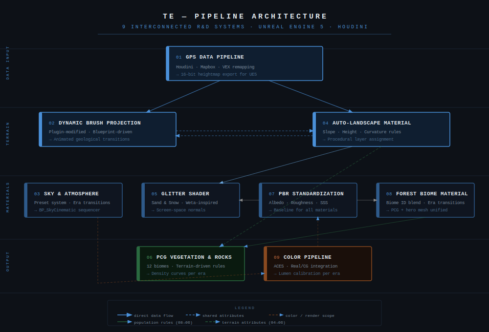

# TE — Procedural Earth Evolution
### Real-Time Pipeline · Unreal Engine 5 · Houdini · Blender

A documentary production pipeline built from scratch in 9 months with a team of 4 — case study of nine interconnected R&D systems.

---

## Overview

TRE is a documentary production depicting the geological evolution of Earth across deep time — from primordial landscapes to contemporary biomes. Scientific plausibility was a hard requirement: environments needed to hold up under expert review without claiming photorealism. The real challenge was building a real-time pipeline that could deliver this level of credibility across radically different geological eras, with a small team, in nine months.

The full pipeline was built around Unreal Engine 5 rather than traditional offline rendering. This decision shaped every technical choice downstream: shader complexity, asset density, memory budgets, and transition systems all had to perform at runtime — no render farm to hide behind.

The R&D work documented here covers nine interconnected systems developed over the course of production.

## Production context

- **Duration:** 9 months, end to end
- **Team:** 4 people — 2 generalist artists, 1 developer, 1 CG Supervisor / TD (myself)
- **My role:** pipeline architecture, R&D lead, base scene authoring, team supervision
- **Constraint:** small team, real-time output, integration with live-action footage
- **Outcome:** the systems below went into final production use — they shipped, they held up, and they were maintainable by the rest of the team

Every decision documented in this repo was made under production constraints, not as pure research. The trade-offs reflect that.

---

## Table of Contents

1. [GPS Data Pipeline — Houdini Heightmap Generation](#1-gps-data-pipeline--houdini-heightmap-generation)
2. [Dynamic Landscape Brush Projection](#2-dynamic-landscape-brush-projection)
3. [Sky & Atmosphere Preset System](#3-sky--atmosphere-preset-system)
4. [Auto-Landscape Material Layer System](#4-auto-landscape-material-layer-system)
5. [Glitter Shader — Sand & Snow (Weta-inspired)](#5-glitter-shader--sand--snow-weta-inspired)
6. [PCG Vegetation & Rock Population](#6-pcg-vegetation--rock-population)
7. [PBR Pipeline Standardization](#7-pbr-pipeline-standardization)
8. [Forest Biome Material Function](#8-forest-biome-material-function)
9. [Color Pipeline & Real/CG Integration](#9-color-pipeline--realcg-integration)

---

## 1. GPS Data Pipeline — Houdini Heightmap Generation

### Problem
The production required geologically accurate terrain (not just visually plausible landscapes), but environments defensible against scientific review. Sculpting terrain by hand introduced too much artistic bias and was incompatible with the documentary's credibility requirements.

### Approach
Real-world elevation data was sourced from Mapbox via an old lab node originally built for Houdini 18 and 19. The node was incompatible with Houdini 21 — rather than finding a workaround or switching data source, the node source was patched directly to restore compatibility. The pipeline converts GPS coordinate ranges into normalized height data, then applied geological-scale smoothing and erosion passes, and exports heightmaps compatible with UE5's landscape system.

### Implementation
- Diagnosed Houdini 19 → 21 compatibility breakage in Mapbox lab node source, patched and rebuilt
- VEX-based remapping normalizes elevation ranges to 16-bit heightmap output
- Erosion passes (hydraulic + thermal) calibrated against reference geology photography
- Output feeds directly into UE5 landscape import pipeline with correct bit depth and import settings

### Key decisions
Two options on the table: swap Mapbox for a different data source, or fix the existing node. Swapping meant re-evaluating the full data pipeline and retraining artists on a new workflow — a week of work at best. Patching the node took half a day and preserved every downstream process. The trade-off was ongoing maintenance of a patched third-party node, accepted as a contained risk.

A side benefit: going into the source gave full visibility into the data processing chain, which paid off later when debugging terrain artifacts at unusual coordinate ranges.

---

## 2. Dynamic Landscape Brush Projection

### Problem
UE5's native landscape brush projection tools operate statically — brushes are applied at edit time and baked into the landscape data. TE required runtime-dynamic terrain painting to support animated geological transitions: ice sheet advance and retreat, volcanic ash deposition, sediment layering, erosion on moutains.

### Approach
An existing landscape brush projection plugin was modified and extended to support a distinction between fixed brushes (baked at edit time, zero runtime cost) and dynamic brushes (evaluated on utilization and not on every frame, used for animated transitions). The plugin was also patched to address production-specific limitations. Control is entirely Blueprint-driven — no C++ modifications were required.

### Implementation
- Plugin source modified to expose brush type differentiation: fixed brushes compile to static landscape data; dynamic brushes remain runtime-evaluated
- Dynamic brush parameters (radius, falloff, contrast, intensity) exposed as Blueprint-accessible properties
- Blueprint controller (`BP_LandscapeController`) handles brush sequencing, position and transition timing
- Fixed/dynamic split designed explicitly for performance: only brushes requiring animation carry runtime evaluation cost
- Validated memory overhead of dynamic brush evaluation against project budget constraints

### Key decisions
The fixed/dynamic split was the whole performance story. First pass had every brush evaluated at runtime (it looked flexible on paper), it tanked frame budget in practice. Splitting the brushes by whether they actually needed to animate brought runtime cost back under control while keeping full flexibility where transitions required it. Trade-off: slightly more complex authoring logic (artists had to decide upfront which category a brush belonged to), absorbed by clear documentation and default presets.

---

## 3. Sky & Atmosphere Preset System

### Problem
TE spans geological eras with dramatically different atmospheric compositions — from a reducing early-Earth atmosphere (methane-heavy, no oxygen, orange-red sky) through oxygenation events to modern conditions. Managing these transitions manually per shot was not scalable across 9 months of production with a small team.

### Approach
Built on top of an existing sky/atmosphere plugin, modified to meet production requirements. A Blueprint-driven cinematic system handles the sequencing of sky states via a custom list structure containing ordered sky presets. Artists define presets and sequence them; the system handles interpolation and playback.

### Implementation
- Base sky plugin modified to expose additional parameters and support production-scale preset management
- Custom list structure stores ordered sky presets with per-transition timing and curve data
- `BP_SkyCinematic` Blueprint reads the list sequentially and drives all SkyAtmosphere + VolumetricCloud + ExponentialHeightFog parameters
- Preset library covers scientifically referenced atmospheric states across geological eras
- Non-technical team members can author and reorder sky states without touching Blueprint logic

### Key decisions
Sequencer keyframing was the obvious path but made reordering expensive (swap two eras and half the keyframes need to move). A list-driven system turns that into a single edit. Trade-off: less granular control inside a transition compared to hand-tuned keyframes, mitigated by exposing per-parameter curves in the preset structure itself.

---

## 4. Auto-Landscape Material Layer System

### Problem
UE5's default landscape material workflow requires manual layer painting (artists explicitly assign material zones across the terrain). At TE's scale and iteration speed, this was a bottleneck: every terrain update required repainting, and geological accuracy demanded that material distribution follow elevation, slope, and curvature rules rather than artistic approximation.

### Approach
An automatic material layer system was built by dissecting an existing landscape master material and rebuilding it with a new layer blending logic around procedural rules. Layers are assigned based on real-time terrain analysis (slope angle, world height, surface curvature, aspect direction) rather than painted weightmaps.

### Implementation
- Base landscape master material deconstructed to add layer blending nodes
- Custom material functions compute slope (from vertex normal), normalized world height, and curvature from adjacent sample comparison
- Each geological layer (bare rock, scree, sediment, soil, ice) has an activation curve driven by these parameters
- Layer transitions use distance-field-based dithering to avoid hard edges at geological boundaries and can be called
- Manual override channel preserved for art direction on hero areas
- Material Parameter Collection (MPC) exposes global biome lerp values — allows shot-level look adjustments (color temperature, surface wetness, overall biome character) without touching the material graph
- Full dynamic update at runtime — terrain material responds immediately to landscape deformation (see section 2)

### Key decisions
Building from scratch was tempting for architectural cleanliness but meant re-solving every UE5 landscape edge case already handled by the base shader — UV scaling, normal blending, texture bombing. Starting from an existing master material and rewriting the layers logic kept the tested foundations and focused the work where it mattered. Trade-off: the material graph is denser than a greenfield implementation, managed through aggressive use of material functions for readability.

---

## 5. Glitter Shader — Sand & Snow (Weta-inspired)

### Problem
Sand and snow surfaces at TE's geological scales exhibit a characteristic specular glitter — individual grain-scale light interactions that produce a sparkling, high-frequency highlight pattern. Standard PBR shaders smooth over this phenomenon, producing surfaces that read as flat and unconvincing at the distances required by the production.

### Approach
Implementation draws from published research on glitter and flake rendering, notably techniques developed at Weta Digital specifically for UE for sand surfaces in feature film production. The approach models per-grain normal variation as a stochastic normal distribution sampled in screen space, producing view-dependent glitter that scales correctly with camera distance.

### Implementation
- Screen-space normal perturbation using tiling noise at multiple frequencies
- Glitter density, scale, and intensity exposed as scalar parameters for per-asset calibration
- Separate parameterization for sand (warm, lower intensity, directional) and snow (cool, higher intensity, isotropic)
- Aliasing at distance managed at the pipeline level via TSR + DLAA configuration — no per-shader LOD logic required (as we strongly used Nanite)
- Implemented as a Material Function for reuse across all sand and snow surface materials in the project

### Key decisions
We used a logic split between a texture based implementation and custom normal calculation in order to get the most of this effect without hitting the limits of TSR and DLAA. The harder decision was what to do about distance aliasing: rather than baking LOD fade logic into the shader itself (which couples rendering concerns to anti-aliasing concerns), the pipeline-level TSR + DLAA configuration handled it. Cleaner separation of responsibilities, lighter shader.

---

## 6. PCG Vegetation & Rock Population

### Problem
Populating TE's terrain with geologically plausible vegetation and rock distributions at production scale (across 12 distinct biomes at most) was not feasible through manual placement. The system needed to respond to terrain analysis data (same slope/height/curvature data driving the material system) and remain editable by artists without requiring technical knowledge.

### Approach
Co-developed with the project's developer, a PCG (Procedural Content Generation) graph was built in UE5's PCG framework to drive all vegetation and rock placement. The system reads terrain attributes computed by the material layer system and uses them as placement rules, with per-biome asset lists and density curves exposed in custom BP.

### Implementation (TD contribution)
- Defined placement rule architecture: which terrain attributes drive which asset categories
- Authored density curves per biome — e.g., conifer density peaks at 400-1200m elevation on north-facing slopes
- Designed exclusion logic between asset categories (rocks exclude vegetation within radius, large trees suppress undergrowth)

- Validated output against geological reference photography for each era

### Key decisions
A pure-TD implementation would have meant learning the full PCG framework mid-production; a pure-dev implementation would have meant the developer making artistic judgment calls on vegetation distribution. Splitting by what each person knew best — rule design and visual validation on my side, PCG graph mechanics and performance on the developer side — kept both of us in our zone and let the work run in parallel. The system also stayed maintainable by either party afterwards.

---

## 7. PBR Pipeline Standardization

### Problem
With two generalist artists and assets sourced from multiple origins (in-house, photogrammetry, library, online), material consistency across the project was at risk. Inconsistent roughness ranges, mismatched normal map conventions, and non-calibrated albedo values would accumulate into visible quality variance across shots.

### Approach
A PBR calibration standard was defined and documented at project start, covering the full asset pipeline from source material authoring to engine import. Validation tools were added to the review process.

### Implementation
- Defined albedo range targets per material category, referenced against established PBR guides
- Documented roughness convention and metallic channel usage
- Normal map convention standardized (OpenGL) across all DCC tools in the pipeline
- Created reference material sphere set in UE5 for in-engine calibration checks
- Short internal documentation distributed to both artists at project start

### Key decisions
The choice was whether to standardize upfront or correct drift in post. Upfront cost: a few days of documentation and tool setup. Post-correction cost: accumulating small inconsistencies over 9 months, then fixing them late when context is lost and shots are already downstream. On a 4-person team the upfront investment was trivial relative to the alternative. Not glamorous work — exactly the kind that saves a production from quiet quality erosion.

---

## 8. Forest Biome Material Function

### Problem
Forest biomes in TRE transition across geological eras (from early carboniferous tree ferns through coniferous forests to broadleaf deciduous environments). These transitions needed to be smooth, artistically controllable, and consistent with the terrain material system driving the landscape beneath.

### Approach
A Material Function handles forest biome blending by ID, driven by a scalar parameter that maps to a blend curve between biome states. Each biome state defines its own ground cover, undergrowth color, and surface detail parameters. The function is bound to a specific shader and static mesh — making it usable both as a standalone mesh material and as a PCG-instanced asset, without requiring separate material variants.

### Implementation
- Biome states defined as indexed parameter sets (0 = carboniferous, 1 = coniferous, 2 = broadleaf temperate, etc.)
- Blend parameter drives smooth interpolation between adjacent biome states via custom curve assets
- Ground cover albedo, roughness variation, and micro-detail tiling all blend independently per state, also added a 3D noise injection to break the linearity of meshes placement
- Biome ID parameter exposed at material instance level — sequencer-drivable for transition shots, also added a leaf opacity control to simulate biome death
- Single shader/mesh binding means the same asset works in PCG population (section 6) and as a hand-placed hero mesh — no duplication, consistent look in all contexts

### Key decisions
A fully generic multi-mesh blending system was on the table and would have been more "correct" architecturally — but it would have taken significantly longer to build and the project didn't actually need the flexibility. Locking the function to a specific shader and mesh was a deliberate scope cut that matched actual use cases exactly. The real win was using the same material for both PCG instancing and hand-placed hero meshes — no duplication, automatic visual consistency, no manual sync step to forget.

---

## 9. Color Pipeline & Real/CG Integration

### Problem
TE's final output had to composite CG environments against real footage, with no clean colorimetric common ground between UE5's internal color space and the reference camera footage. On top of that, geological eras have very different luminance profiles — an early-Earth reducing atmosphere and a modern sky sit at opposite ends of the dynamic range. The pipeline needed to handle both without clipping highlights, while preserving enough latitude for post-production grading.

### Approach
Pure-technical color pipelines weren't going to solve the match problem — the footage had no embedded color profile and the geological references were artistic reconstructions, not measurable ground truth. The approach combined objective measurement tools for the foundation with perceptual calibration against shared real-world reference elements for the final match. Goal: a stable, predictable base scene that the rest of the team could build on.

ACES was selected as the working color space — wider dynamic range handling, more progressive GI response than UE5's default filmic tone mapper. This mattered specifically for Lumen's behavior across scenes with radically different atmospheric conditions.

### Implementation
- ACES tone mapping configured as the project-wide standard from day one, before any lighting work began
- Color Calibrator used to establish base exposure reference per scene type
- Pixel Inspector used for objective luminance measurement on key surface categories: vegetation, soil, sky gradients
- Shared reference elements (vegetation, earth, sky) chosen as calibration anchors — they exist in both real footage and CG environments, providing perceptual common ground without requiring a formal color chart
- Initial scenes authored as calibrated base states; artists inherited a stable starting point with predictable light behavior
- Fixed exposure compensation adjusted per era for atmospheric density differences
- Final judgment based on perceptual matching against reference footage, not numeric targets alone

### Key decisions
A purely algorithmic approach would have been cleaner on paper but it wasn't going to deliver (the inputs were too irregular). A purely perceptual approach would have worked for one person but not for a team over 9 months. The hybrid (measurement tools as objective foundation, perceptual judgment for the final match) gave the team a reliable common reference while leaving the final call to the eye.

The ACES choice had a concrete payoff downstream: Lumen's highlight response in ACES is more forgiving, which cut the number of manual exposure corrections needed per shot when transitioning between high-contrast environments. A small decision at project start that saved significant time over the production.

---

## Stack

| Tool | Usage |
|------|-------|
| Unreal Engine 5 | Real-time pipeline, final output, PCG, material system |
| Houdini (VEX, Python, SOP) | GPS data processing, heightmap generation, erosion simulation |
| Blender | Asset modeling, photogrammetry cleanup, asset verification |
| Blueprint (UE5) | Runtime systems, cinematic controller, landscape brush logic |
| HLSL / UE5 Material Graph | All shader and material function development |
| Material Parameter Collections | Global biome lerp, shot-level look control |
| ACES / UE5 Color Calibrator | Color pipeline, real/CG integration calibration |
| Python | Houdini data pipeline, node patching, import automation |

---

## Notes

This repository documents the technical pipeline and the decisions behind it — not the project's visual output, which remains under NDA. R&D captures and material breakdowns available on request.

The goal here is to make the reasoning transparent: each system is presented with the problem it solved, the approach taken, and the trade-offs accepted. Production work under constraint rarely has clean answers — the interesting question is usually which imperfect answer made it to production.

---

*Baptiste P. — CG Supervisor & Senior TD*  
*[linkedin.com/in/baptiste-p-cgsupervisor](https://linkedin.com/in/baptiste-p-cgsupervisor)*
